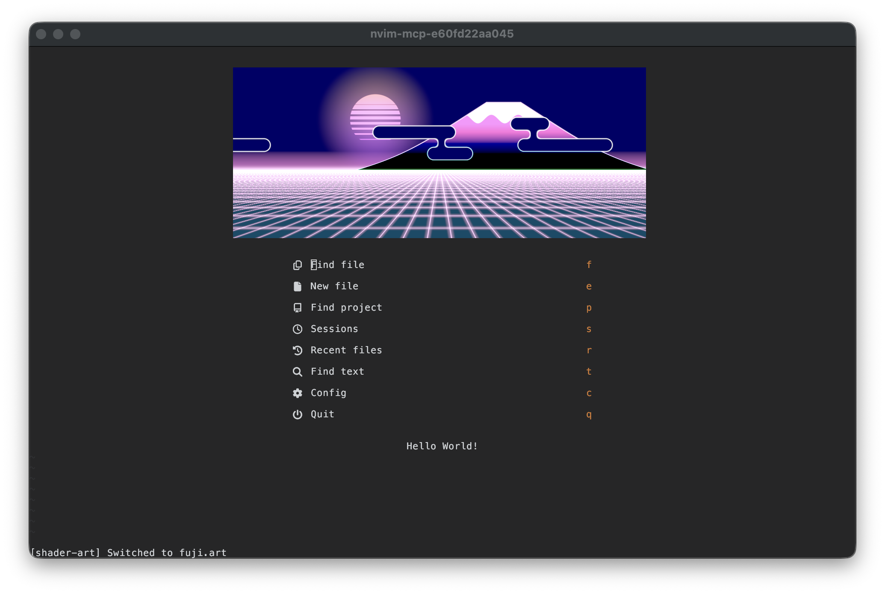
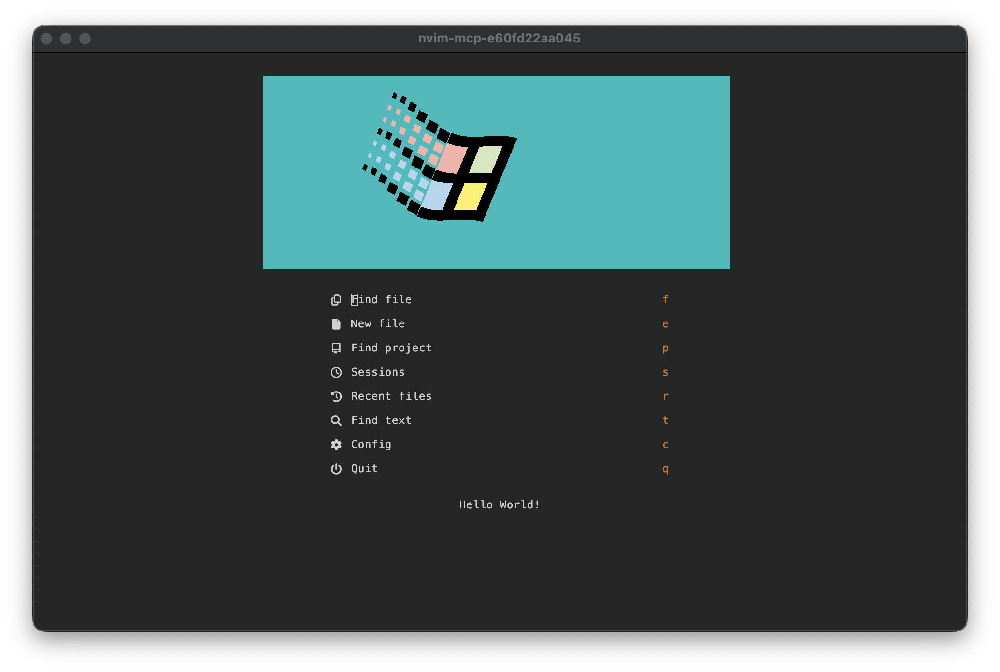
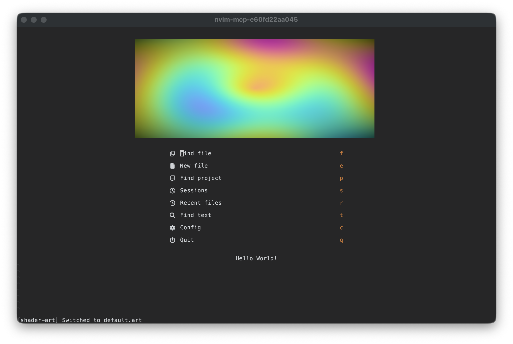
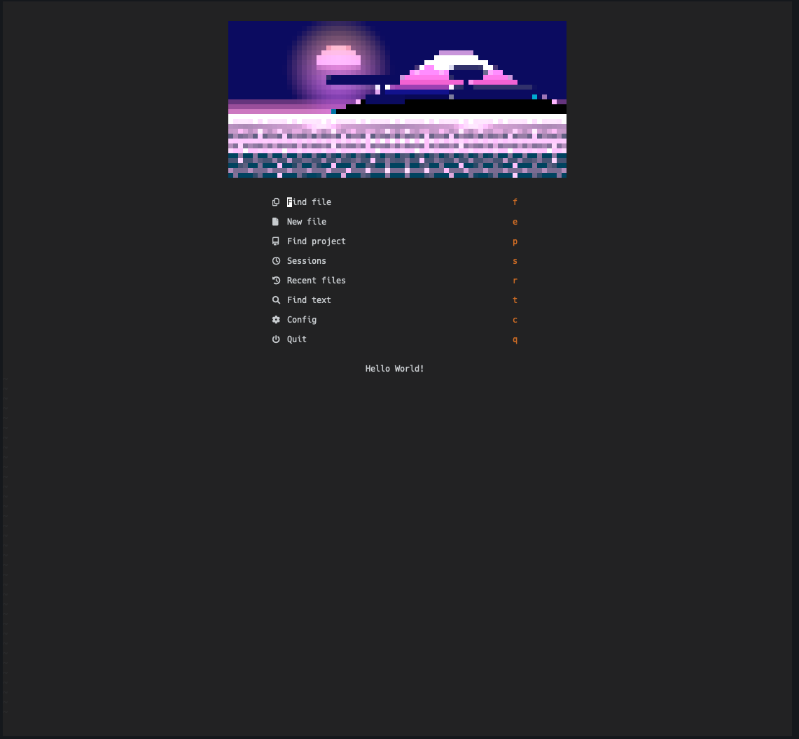
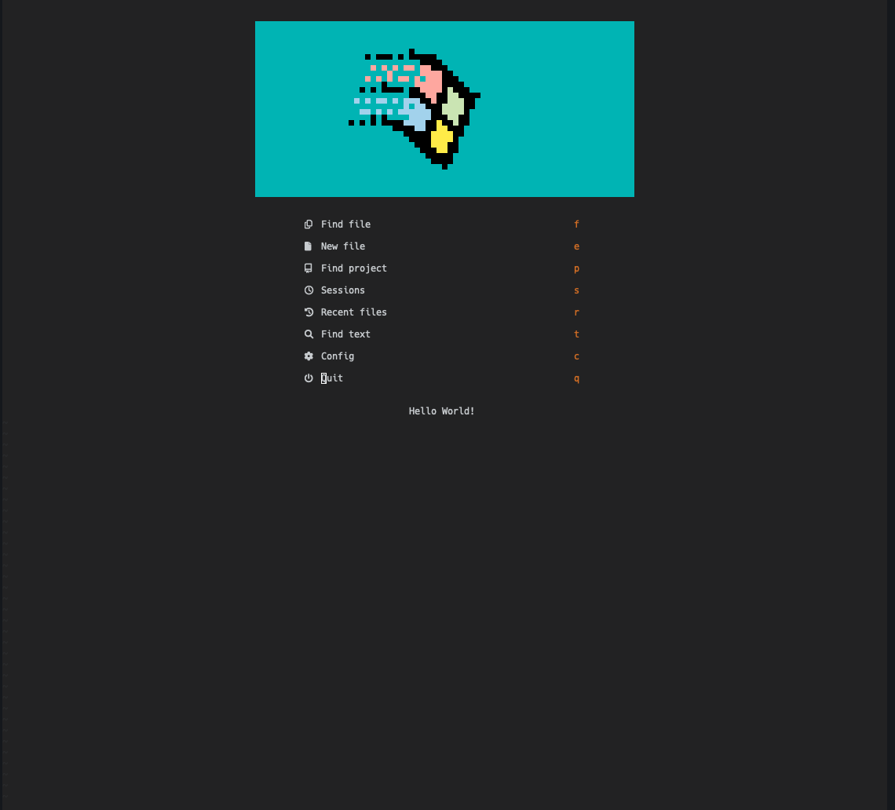
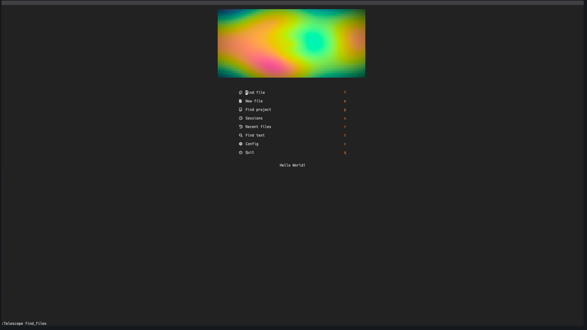

# nvim-shader-art

GPU-accelerated animated shader art on your Neovim dashboard.

Renders Shadertoy-compatible GLSL shaders via a headless wgpu sidecar (Metal on
macOS, Vulkan on Linux) and displays them on the
[alpha-nvim](https://github.com/goolord/alpha-nvim) start screen.

A random bundled shader is selected each time alpha opens.

### Kitty graphics protocol (Kitty, Ghostty)

| fuji.art | windows.art | default.art |
|----------|-------------|-------------|
|  |  |  |

### ASCII half-block (iTerm2, WezTerm, everything else)

| fuji.art | windows.art | default.art |
|----------|-------------|-------------|
|  |  |  |

```
.art file (GLSL) --> Rust sidecar (wgpu) --> frame stream --> Neovim
                     headless GPU render         |
                                           +-----+-----+
                                           |           |
                                         Kitty       ASCII
                                       (graphics)  (half-block)
```

## Terminal support

| Terminal           | Mode  | Notes                               |
| ------------------ | ----- | ----------------------------------- |
| Kitty              | kitty | Full Kitty graphics protocol        |
| Ghostty            | kitty | Kitty graphics protocol             |
| iTerm2 / WezTerm   | ascii | Sixel detection exists, renders ASCII in Neovim |
| Everything else    | ascii | Half-block + truecolor ANSI         |

Kitty mode renders at native cell resolution with double-buffered image
placement (no flicker). ASCII mode uses Unicode half-blocks with 24-bit color.

## Requirements

- **Neovim** >= 0.11
- **Rust** toolchain (`cargo`) &mdash; the sidecar is compiled automatically on
  first install
- **GPU** &mdash; any Metal (macOS) or Vulkan (Linux) capable GPU
- **alpha-nvim** &mdash; dashboard plugin

## Install

### lazy.nvim

```lua
{
  "InfJoker/nvim-shader-art",
  dependencies = { "goolord/alpha-nvim" },
  event = "VimEnter",
  build = "cd shader-art-render && cargo build --release",
  opts = {
    -- shader = nil,    -- nil = random bundled shader each time
    -- mode = "auto",   -- "auto" | "kitty" | "ascii"
    -- fps = 15,
  },
}
```

The `build` step compiles the Rust sidecar once. Subsequent updates only
rebuild if Cargo detects changes.

### Alpha integration

In your alpha config, create the shader element and add it to the layout:

```lua
-- in your alpha setup
require "alpha.term" -- required for terminal layout elements

local shader_ok, shader_art = pcall(require, "shader-art")
local shader_el = nil
if shader_ok then
  shader_el = shader_art.make_element { width = 69, height = 16, fps = 15 }
end

-- Use shader_el in your alpha layout, with a fallback:
local header
if shader_el then
  header = shader_el
else
  header = { type = "text", val = { "your static header" }, opts = { position = "center" } }
end
```

On `AlphaClosed`, the plugin automatically stops the sidecar and cleans up
terminal graphics. On re-open, it restarts with a new random shader.

## Shader files

Shader files use the `.art` extension and contain Shadertoy-compatible GLSL.
They must define a `mainImage(out vec4 fragColor, in vec2 fragCoord)` function.

Available uniforms:

| Uniform       | Type    | Description                    |
| ------------- | ------- | ------------------------------ |
| `iResolution` | `vec3`  | Viewport resolution in pixels  |
| `iTime`       | `float` | Elapsed time in seconds        |
| `iMouse`      | `vec4`  | Mouse position (unused)        |
| `iFrame`      | `int`   | Frame counter                  |

### Bundled shaders

- `fuji.art` &mdash; Synthwave Mt. Fuji (CC BY 3.0, Jan Mroz)
- `windows.art` &mdash; Animated Windows logo
- `default.art` &mdash; Plasma gradient

Cycle through them with `:ShaderArtNext`. On each alpha open, a random
bundled shader is selected automatically.

### Adding custom shaders

**Option 1: Point to a file**

Set the `shader` option to a specific `.art` file. This disables random
selection and always uses that shader:

```lua
opts = {
  shader = vim.fn.expand "~/my-shaders/cool.art",
}
```

**Option 2: Add to the bundled pool**

Drop `.art` files into the plugin's `shaders/` directory:

```
~/.local/share/nvim/lazy/nvim-shader-art/shaders/my-shader.art
```

They'll be included in random selection and `:ShaderArtNext` cycling.

**Option 3: Local dev (for shader authors)**

If using a local dev copy of the plugin:

```lua
{ dir = "~/nvim-shader-art", ... }
```

Just add `.art` files to `~/nvim-shader-art/shaders/`.

### Writing a shader from scratch

Create a `.art` file with a Shadertoy-compatible `mainImage` function:

```glsl
void mainImage(out vec4 fragColor, in vec2 fragCoord) {
    vec2 uv = fragCoord / iResolution.xy;
    float t = iTime;

    // Your shader logic here
    vec3 col = 0.5 + 0.5 * cos(t + uv.xyx + vec3(0, 2, 4));

    fragColor = vec4(col, 1.0);
}
```

The sidecar wraps your code in a GLSL 450 template with Shadertoy uniforms
(`iResolution`, `iTime`, `iMouse`, `iFrame`) and translates it to WGSL via
naga.

**Limitations:**
- Procedural shaders only (no `iChannel0`&ndash;`3` texture inputs)
- Single-pass only (no Shadertoy Buffer A/B/C/D)
- No audio/video uniforms

Most visually striking Shadertoy shaders (raymarching, fractals, noise, SDFs,
plasma, synthwave) are procedural and work without modification.

**Testing a shader outside Neovim:**

```sh
cd ~/nvim-shader-art
cargo run --release -- --mode ascii --width 69 --height 32 --fps 15 shaders/my-shader.art
```

Press `Ctrl-C` to stop. If the shader has compile errors, they'll appear on
stderr with adjusted line numbers.

### Porting shaders from Shadertoy

1. Go to [shadertoy.com](https://www.shadertoy.com), find a shader you like
2. Check that it uses **no textures** (Image tab only, no Buffer/Sound tabs)
3. Copy the GLSL code into a new `.art` file
4. Remove any `#ifdef GL_ES` / `precision` lines (not needed)
5. Test with the CLI command above

## How it works

1. The Rust sidecar renders GLSL shaders headlessly on the GPU using wgpu
2. naga translates GLSL 450 to WGSL at startup
3. Each frame: render to texture, read back pixels, encode, write to stdout
4. **Kitty mode**: sidecar outputs `width,height,cols,rows;base64png` lines to
   stdout. The Lua plugin wraps each frame in Kitty APC escapes and writes to
   the terminal. Double-buffering (two alternating image IDs) prevents flicker.
5. **ASCII mode**: sidecar outputs half-block ANSI frames directly. The Lua
   plugin writes them to the real tty with cursor positioning.

## License

MIT
